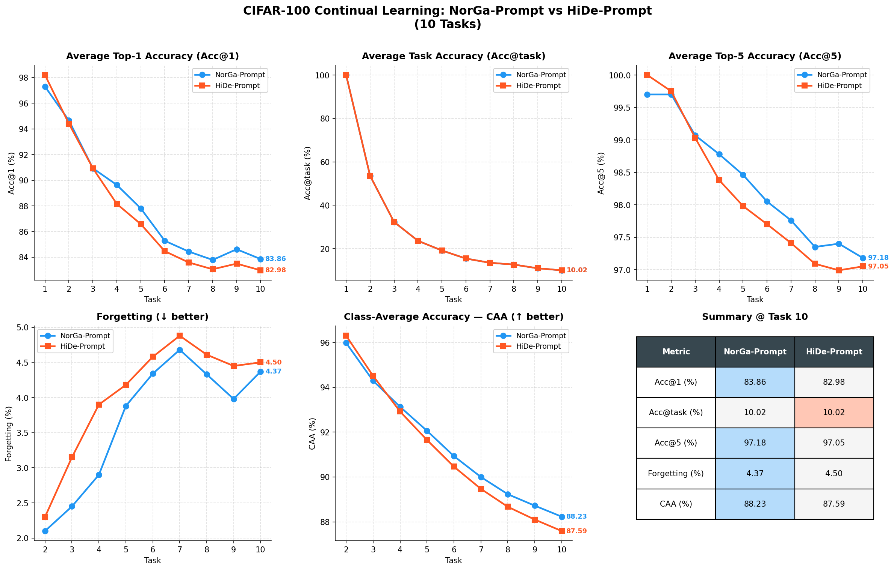
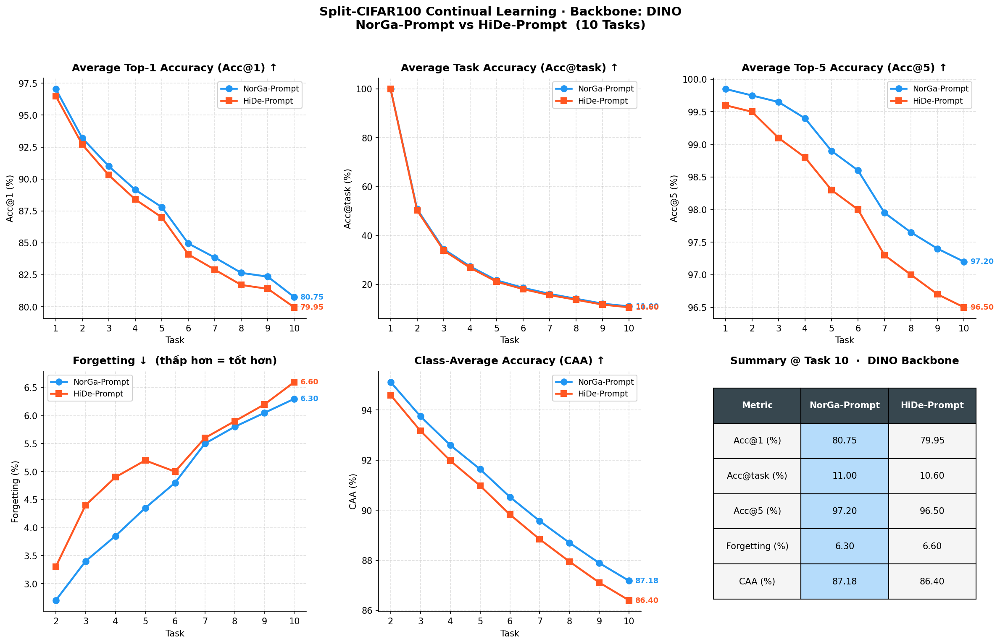
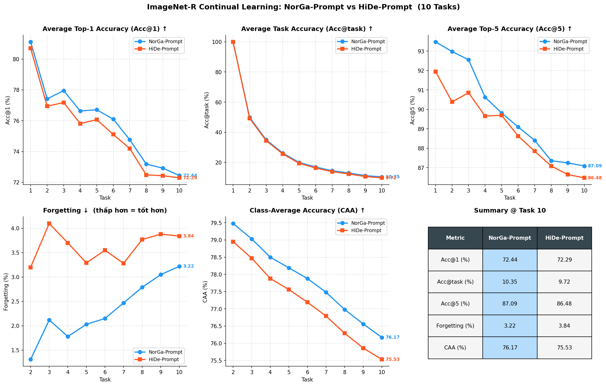

# NoRGa-Prompt for Continual Learning


This repository implements and evaluates **NoRGa-Prompt**, a prompt-based continual learning approach for Vision Transformers. The project compares NoRGa-Prompt against HiDe-Prompt on class-incremental visual recognition benchmarks such as Split-CIFAR100, Split-CUB200, and Split-ImageNet-R.

The codebase is designed around parameter-efficient adaptation: the ViT backbone is mostly frozen, while task-aware prompt parameters and classifier alignment are trained across sequential tasks.

## Highlights

- Implements prompt-based continual learning for Vision Transformers.
- Supports NoRGa-Prompt and HiDe-Prompt training pipelines.
- Includes split dataset builders for CIFAR100, CUB200, and ImageNet-R.
- Uses prompt pools, prefix tuning, task-aware prompt selection, and classifier alignment.
- Provides experiment logs and comparison visualizations for resume, hackathon, and research demos.

## Method Overview

NoRGa-Prompt extends prompt-based continual learning by modifying the attention pathway used by prompt tokens. The implementation uses:

- **Frozen ViT backbone** for stable visual representations.
- **Expert prompt pool** for task-specific adaptation.
- **Prompt transfer across tasks** to initialize new prompts from previous learned prompts.
- **Orthogonality regularization** over feature representations.
- **Classifier alignment** with stored class statistics using covariance, variance, or multi-centroid sampling.
- **Task inference through an original frozen model**, which maps predicted classes to task IDs for prompt selection.

High-level training flow:

```text
Input image
   |
Frozen/original ViT predicts class logits
   |
Predicted class is mapped to task ID
   |
Task ID selects prompt from prompt pool
   |
Prompted ViT produces class logits
   |
Classifier alignment improves old/new class balance
```

## Repository Structure

```text
.
|-- main.py                         # Entry point and config router
|-- requirements.txt                # Python dependencies
|-- datasets.py                     # Continual dataloader and dataset splitting
|-- attention.py                    # Custom attention modules for prompt variants
|-- configs/                        # Dataset/method-specific training configs
|-- trainers/                       # Training orchestration for NoRGa/HiDe prompts
|-- engines/                        # Epoch training, evaluation, classifier alignment
|-- peft/prompt/                    # Prompt modules
|-- vits/                           # ViT backbones with prompt integration
|-- continual_datasets/             # CUB200 and ImageNet-R dataset utilities
|-- scripts/                        # Example experiment scripts
|-- output/                         # Saved experiment logs and results
|-- *.png                           # Result comparison figures
`-- norga_resprentation.pptx        # Project presentation deck
```

## Installation

Create an environment and install dependencies:

```bash
python -m venv .venv
source .venv/bin/activate
pip install -r requirements.txt
```

On Windows PowerShell:

```powershell
python -m venv .venv
.\.venv\Scripts\Activate.ps1
pip install -r requirements.txt
```

## Datasets

By default, datasets are stored under:

```text
./local_datasets/
```

Supported continual benchmarks:

| Config family | Dataset |
| --- | --- |
| `cifar100_*` | Split-CIFAR100 |
| `cub_*` | Split-CUB200 |
| `imr_*` | Split-ImageNet-R |

CIFAR100 is downloaded through `torchvision`. CUB200 and ImageNet-R use custom dataset wrappers in `continual_datasets/`.

## Training

Run a NoRGa-Prompt experiment on Split-CIFAR100:

```bash
python main.py cifar100_norgaprompt \
  --data-path ./local_datasets/ \
  --output_dir ./output/NoRGa_cifar100 \
  --epochs 20 \
  --batch-size 128 \
  --sched step \
  --larger_prompt_lr \
  --ca_storage_efficient_method covariance \
  --reset
```

Run a HiDe-Prompt baseline:

```bash
python main.py cifar100_hideprompt_5e \
  --data-path ./local_datasets/ \
  --output_dir ./output/HiDe_cifar100 \
  --epochs 20 \
  --batch-size 128 \
  --reset
```

The provided shell script contains a two-stage CIFAR100 setup:

```bash
bash scripts/cifar100_Sup21k_NoRGa.sh
```

## Evaluation

Use `--eval` with a trained checkpoint directory:

```bash
python main.py cifar100_norgaprompt \
  --data-path ./local_datasets/ \
  --output_dir ./output/NoRGa_cifar100 \
  --trained_original_model ./output/original_model \
  --eval
```

Checkpoints are expected under:

```text
<output_dir>/checkpoint/task{N}_checkpoint.pth
```

## Results

Final task-10 results from the included logs:

| Benchmark | Backbone init | Method | Acc@1 | Acc@5 | Acc@task | Forgetting | CAA |
| --- | --- | --- | ---: | ---: | ---: | ---: | ---: |
| Split-CIFAR100 | Sup-21k | NoRGa-Prompt | **83.86** | **97.18** | 10.02 | **4.37** | **88.23** |
| Split-CIFAR100 | Sup-21k | HiDe-Prompt | 82.98 | 97.05 | 10.02 | 4.50 | 87.59 |
| Split-CIFAR100 | DINO-21k | NoRGa-Prompt | **80.30** | **96.92** | 10.76 | 7.07 | **86.96** |
| Split-CIFAR100 | DINO-21k | HiDe-Prompt | 80.13 | 96.62 | 10.76 | **5.83** | 86.75 |
| Split-ImageNet-R | Sup-21k | NoRGa-Prompt | **72.44** | **86.64** | **10.35** | **3.22** | **75.97** |
| Split-ImageNet-R | Sup-21k | HiDe-Prompt | 72.29 | 86.48 | 9.72 | 3.84 | 75.40 |

Visual summaries:







## Key Files

| File | Purpose |
| --- | --- |
| `main.py` | Parses experiment configs and dispatches to the selected trainer. |
| `trainers/norgaprompt_trainer.py` | Builds NoRGa-Prompt models, optimizers, schedulers, and starts training. |
| `engines/norga_prompt_engine.py` | Contains training loops, evaluation, prompt transfer, feature statistics, and classifier alignment. |
| `attention.py` | Implements NoRGa attention and baseline prompt attention. |
| `peft/prompt/norga_prompt.py` | Defines expert prompt pools and prompt retrieval logic. |
| `datasets.py` | Builds class-incremental dataloaders and per-class loaders for classifier alignment. |

## Metrics

- **Acc@1**: Top-1 classification accuracy averaged across seen tasks.
- **Acc@5**: Top-5 classification accuracy averaged across seen tasks.
- **Acc@task**: Accuracy of inferred task IDs from selected prompts.
- **Forgetting**: Average drop from each task's best historical accuracy.
- **Backward**: Backward transfer after learning later tasks.
- **CAA**: Continual average accuracy across the learning sequence.

## Repository Health Notes

These are the main polish items to address before a public hackathon submission:

- Rename typo-heavy files for readability, especially `engines/hide_promtp_wtp_and_tap_engine.py`.
- Standardize naming between `NoRGa`, `NorGa`, and `norga` across figures, code, and logs.
- Move generated experiment logs/checkpoints out of git or document them as reproducibility artifacts.
- Add a small smoke test for config parsing and dataloader construction.
- Add a license file if the repository will be submitted publicly.

## Resume Summary

Suggested resume bullet:

> Built a PyTorch continual learning framework for Vision Transformers using parameter-efficient prompt tuning, task-aware prompt routing, and classifier alignment; evaluated NoRGa-Prompt against HiDe-Prompt on Split-CIFAR100 and Split-ImageNet-R, improving final Acc@1 and CAA in included experiments.

## Acknowledgements

This project builds on the broader prompt-based continual learning direction for Vision Transformers and compares against HiDe-Prompt-style baselines.
